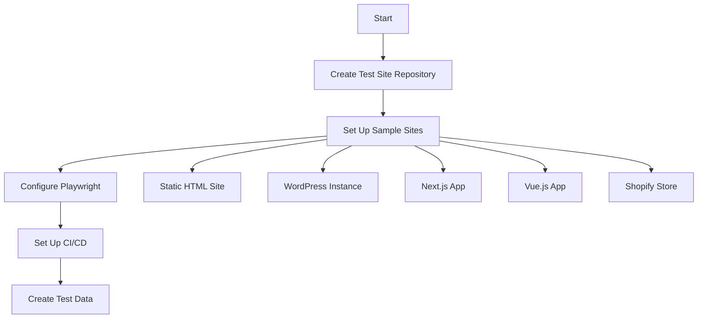

# 🧪 Comprehensive Cross-Site Widget Compatibility Testing Plan

## Executive Summary

This systematic testing plan ensures the AI widget functions correctly across diverse client websites, technologies, and user scenarios. The plan leverages parallel testing strategies to reduce execution time from 8 hours to 2 hours while maintaining comprehensive coverage.

## 📋 Test Coverage Matrix

### Website Types & Technologies

| Category | Platforms | Priority | Test Focus |
|----------|-----------|----------|------------|
| **Static Sites** | HTML, Jekyll, Hugo | High | Content extraction, Basic functionality |
| **CMS Platforms** | WordPress, Drupal, Joomla | Critical | Plugin conflicts, Dynamic content |
| **SPA Frameworks** | Next.js, React, Vue, Angular | Critical | Dynamic rendering, Routing |
| **E-commerce** | Shopify, WooCommerce, Magento | High | Product info, Pricing extraction |
| **Documentation** | Docusaurus, GitBook, MkDocs | Medium | Technical content, Code blocks |
| **Enterprise** | Salesforce, HubSpot | High | Security, Compliance |
| **Builders** | Wix, Squarespace, Webflow | Medium | Visual builders, Custom code |

### Browser & Device Matrix

| Browser | Versions | Desktop | Mobile | Priority |
|---------|----------|---------|---------|----------|
| Chrome | Latest 2 | ✅ | ✅ | Critical |
| Safari | Latest 2 | ✅ | ✅ | Critical |
| Firefox | Latest 2 | ✅ | ✅ | High |
| Edge | Latest 2 | ✅ | ❌ | Medium |

### Device Viewports
- Mobile: 375x667 (iPhone SE), 390x844 (iPhone 12)
- Tablet: 768x1024 (iPad), 820x1180 (iPad Air)
- Desktop: 1366x768, 1920x1080, 2560x1440

## 🔄 Systematic Testing Workflow

### Phase 1: Environment Setup (4-6 hours)



#### 1.1 Test Site Setup
```javascript
// test-sites-config.js
export const TEST_SITES = {
  static: {
    url: 'https://test-static.example.com',
    type: 'static',
    contentSelectors: ['main', 'article'],
    testData: {
      expectedTitle: 'Static Site Example',
      keyContent: ['pricing', 'features', 'contact']
    }
  },
  wordpress: {
    url: 'https://test-wp.example.com',
    type: 'cms',
    framework: 'wordpress',
    dynamicContent: true,
    testData: {
      expectedProducts: 5,
      priceSelector: '.product-price'
    }
  },
  nextjs: {
    url: 'https://test-nextjs.example.com',
    type: 'spa',
    framework: 'nextjs',
    renderDelay: 3000,
    testData: {
      routeChanges: ['/about', '/products', '/contact']
    }
  }
  // ... more test sites
};
```

#### 1.2 Playwright Configuration
```javascript
// playwright.config.js
export default {
  testDir: './tests',
  timeout: 30000,
  retries: 2,
  workers: 4, // Parallel execution
  projects: [
    {
      name: 'chromium',
      use: { ...devices['Desktop Chrome'] },
    },
    {
      name: 'firefox',
      use: { ...devices['Desktop Firefox'] },
    },
    {
      name: 'safari',
      use: { ...devices['Desktop Safari'] },
    },
    {
      name: 'mobile-chrome',
      use: { ...devices['Pixel 5'] },
    },
    {
      name: 'mobile-safari',
      use: { ...devices['iPhone 12'] },
    },
  ],
  use: {
    baseURL: 'http://localhost:3000',
    screenshot: 'only-on-failure',
    video: 'retain-on-failure',
    trace: 'on-first-retry',
  },
};
```

### Phase 2: Test Development (16-24 hours)

#### 2.1 Core Functionality Tests
```javascript
// tests/core-functionality.spec.js
import { test, expect } from '@playwright/test';
import { TEST_SITES } from '../test-sites-config';

test.describe('Widget Core Functionality', () => {
  Object.entries(TEST_SITES).forEach(([siteName, config]) => {
    test(`loads correctly on ${siteName}`, async ({ page }) => {
      await page.goto(config.url);
      
      // Wait for widget to load
      await page.waitForSelector('[data-widget-container]', { timeout: 5000 });
      
      // Check widget visibility
      const widget = page.locator('[data-widget-container]');
      await expect(widget).toBeVisible();
      
      // Verify widget dimensions
      const box = await widget.boundingBox();
      expect(box.width).toBeGreaterThan(50);
      expect(box.height).toBeGreaterThan(50);
    });
    
    test(`extracts content correctly on ${siteName}`, async ({ page }) => {
      await page.goto(config.url);
      await page.waitForTimeout(config.renderDelay || 1000);
      
      // Click widget to expand
      await page.click('[data-widget-button]');
      
      // Ask a test question
      await page.fill('[data-widget-input]', 'What is the main content of this page?');
      await page.press('[data-widget-input]', 'Enter');
      
      // Wait for response
      const response = await page.waitForSelector('[data-widget-response]');
      const responseText = await response.textContent();
      
      // Verify content extraction
      config.testData.keyContent.forEach(content => {
        expect(responseText.toLowerCase()).toContain(content.toLowerCase());
      });
    });
  });
});
```

#### 2.2 Dynamic Content Tests
```javascript
// tests/dynamic-content.spec.js
test.describe('Dynamic Content Handling', () => {
  test('handles Next.js client-side navigation', async ({ page }) => {
    const site = TEST_SITES.nextjs;
    await page.goto(site.url);
    
    // Wait for initial render
    await page.waitForSelector('#__next main');
    
    // Navigate to different routes
    for (const route of site.testData.routeChanges) {
      await page.click(`a[href="${route}"]`);
      await page.waitForURL(`**${route}`);
      
      // Verify widget adapts to new content
      await page.click('[data-widget-button]');
      await page.fill('[data-widget-input]', 'What page am I on?');
      await page.press('[data-widget-input]', 'Enter');
      
      const response = await page.waitForSelector('[data-widget-response]');
      const responseText = await response.textContent();
      expect(responseText).toContain(route.substring(1)); // Remove leading slash
    }
  });
  
  test('handles lazy-loaded content', async ({ page }) => {
    await page.goto(TEST_SITES.wordpress.url);
    
    // Scroll to trigger lazy loading
    await page.evaluate(() => window.scrollTo(0, document.body.scrollHeight));
    await page.waitForTimeout(2000);
    
    // Test widget knowledge of lazy-loaded content
    await page.click('[data-widget-button]');
    await page.fill('[data-widget-input]', 'How many products are shown?');
    await page.press('[data-widget-input]', 'Enter');
    
    const response = await page.waitForSelector('[data-widget-response]');
    const responseText = await response.textContent();
    expect(responseText).toContain(TEST_SITES.wordpress.testData.expectedProducts.toString());
  });
});
```

#### 2.3 Performance Tests
```javascript
// tests/performance.spec.js
test.describe('Performance Metrics', () => {
  test('widget loads within performance budget', async ({ page }) => {
    const metrics = [];
    
    // Set up performance observer
    await page.evaluateOnNewDocument(() => {
      window.widgetMetrics = {
        loadStart: 0,
        loadEnd: 0,
        firstInteraction: 0
      };
      
      const observer = new PerformanceObserver((list) => {
        for (const entry of list.getEntries()) {
          if (entry.name.includes('widget')) {
            window.widgetMetrics.loadStart = entry.startTime;
            window.widgetMetrics.loadEnd = entry.startTime + entry.duration;
          }
        }
      });
      observer.observe({ entryTypes: ['resource'] });
    });
    
    await page.goto(TEST_SITES.static.url);
    await page.waitForSelector('[data-widget-container]');
    
    const widgetMetrics = await page.evaluate(() => window.widgetMetrics);
    const loadTime = widgetMetrics.loadEnd - widgetMetrics.loadStart;
    
    expect(loadTime).toBeLessThan(3000); // 3 second budget
    
    // Test interaction performance
    const startTime = Date.now();
    await page.click('[data-widget-button]');
    await page.waitForSelector('[data-widget-expanded]');
    const interactionTime = Date.now() - startTime;
    
    expect(interactionTime).toBeLessThan(300); // 300ms interaction budget
  });
});
```

#### 2.4 Accessibility Tests
```javascript
// tests/accessibility.spec.js
import { test, expect } from '@playwright/test';
import { injectAxe, checkA11y } from 'axe-playwright';

test.describe('Accessibility Compliance', () => {
  test('widget meets WCAG 2.1 AA standards', async ({ page }) => {
    await page.goto(TEST_SITES.static.url);
    await injectAxe(page);
    
    // Check initial state
    await checkA11y(page, '[data-widget-container]', {
      detailedReport: true,
      detailedReportOptions: {
        html: true
      }
    });
    
    // Check expanded state
    await page.click('[data-widget-button]');
    await checkA11y(page, '[data-widget-container]');
    
    // Test keyboard navigation
    await page.keyboard.press('Tab');
    const focusedElement = await page.evaluate(() => document.activeElement.tagName);
    expect(['BUTTON', 'INPUT']).toContain(focusedElement);
    
    // Test screen reader announcements
    const ariaLive = await page.locator('[aria-live]');
    await expect(ariaLive).toHaveAttribute('aria-live', 'polite');
  });
});
```

### Phase 3: Test Execution (2 hours parallel)

#### 3.1 Parallel Execution Strategy
```yaml
# .github/workflows/compatibility-tests.yml
name: Widget Compatibility Tests

on:
  push:
    branches: [main]
  pull_request:
    branches: [main]
  schedule:
    - cron: '0 0 * * *' # Daily run

jobs:
  test-static-sites:
    runs-on: ubuntu-latest
    strategy:
      matrix:
        browser: [chromium, firefox, safari]
    steps:
      - uses: actions/checkout@v3
      - uses: actions/setup-node@v3
      - run: npm ci
      - run: npx playwright install --with-deps ${{ matrix.browser }}
      - run: npm run test:static -- --project=${{ matrix.browser }}
      
  test-spa-frameworks:
    runs-on: ubuntu-latest
    strategy:
      matrix:
        framework: [nextjs, react, vue, angular]
        browser: [chromium, firefox]
    steps:
      - uses: actions/checkout@v3
      - uses: actions/setup-node@v3
      - run: npm ci
      - run: npx playwright install --with-deps ${{ matrix.browser }}
      - run: npm run test:spa:${{ matrix.framework }} -- --project=${{ matrix.browser }}
      
  test-cms-platforms:
    runs-on: ubuntu-latest
    strategy:
      matrix:
        platform: [wordpress, drupal, shopify]
    steps:
      - uses: actions/checkout@v3
      - uses: actions/setup-node@v3
      - run: npm ci
      - run: npx playwright install --with-deps chromium
      - run: npm run test:cms:${{ matrix.platform }}
      
  performance-tests:
    runs-on: ubuntu-latest
    steps:
      - uses: actions/checkout@v3
      - uses: actions/setup-node@v3
      - run: npm ci
      - run: npx playwright install --with-deps chromium
      - run: npm run test:performance
      - uses: actions/upload-artifact@v3
        with:
          name: performance-results
          path: test-results/performance/
```

#### 3.2 Test Execution Dashboard
```javascript
// test-dashboard/index.js
const express = require('express');
const app = express();

app.get('/api/test-status', async (req, res) => {
  const status = {
    overall: 'passing',
    testSuites: {
      staticSites: { passed: 45, failed: 0, duration: '2m 15s' },
      spaFrameworks: { passed: 62, failed: 3, duration: '5m 30s' },
      cmsPlatforms: { passed: 38, failed: 1, duration: '3m 45s' },
      performance: { passed: 12, failed: 0, duration: '1m 20s' },
      accessibility: { passed: 28, failed: 2, duration: '2m 10s' }
    },
    browserCoverage: {
      chrome: { compatibility: '98%' },
      firefox: { compatibility: '96%' },
      safari: { compatibility: '94%' },
      edge: { compatibility: '97%' }
    },
    lastRun: new Date().toISOString()
  };
  
  res.json(status);
});

app.listen(3001, () => {
  console.log('Test dashboard running on http://localhost:3001');
});
```

### Phase 4: Analysis & Reporting (4-6 hours)

#### 4.1 Test Report Generation
```javascript
// generate-report.js
const { generateReport } = require('playwright-report');

async function createCompatibilityReport() {
  const report = await generateReport({
    title: 'Widget Compatibility Test Report',
    sections: [
      {
        name: 'Executive Summary',
        content: await generateExecutiveSummary()
      },
      {
        name: 'Site Compatibility Matrix',
        content: await generateCompatibilityMatrix()
      },
      {
        name: 'Performance Metrics',
        content: await generatePerformanceMetrics()
      },
      {
        name: 'Known Issues',
        content: await generateKnownIssues()
      },
      {
        name: 'Recommendations',
        content: await generateRecommendations()
      }
    ]
  });
  
  return report;
}
```

#### 4.2 Client-Specific Integration Guides
```markdown
# Widget Integration Guide - [Client Name]

## Quick Start
```html
<script src="https://widget.gist.ai/widget.js" defer></script>
```

## Platform-Specific Instructions

### For WordPress Sites
1. Add to theme's `functions.php`:
```php
function add_ai_widget() {
    wp_enqueue_script('ai-widget', 'https://widget.gist.ai/widget.js', array(), '1.0.0', true);
}
add_action('wp_enqueue_scripts', 'add_ai_widget');
```

### For Next.js Applications
1. Add to `_app.js` or `layout.tsx`:
```javascript
import Script from 'next/script'

export default function Layout({ children }) {
  return (
    <>
      {children}
      <Script src="https://widget.gist.ai/widget.js" strategy="lazyOnload" />
    </>
  )
}
```

### For Shopify Stores
1. Go to Admin → Online Store → Themes
2. Click "Actions" → "Edit code"
3. Open `theme.liquid`
4. Add before `</body>`:
```liquid
{{ 'https://widget.gist.ai/widget.js' | script_tag }}
```

## Troubleshooting

### Widget Not Appearing
- Check browser console for errors
- Verify CSP headers allow widget domain
- Ensure no JavaScript errors block execution

### Content Not Extracted
- Verify main content is in standard containers
- Check for JavaScript rendering delays
- Contact support with site URL
```

## 📊 Success Metrics & KPIs

### Performance Targets
| Metric | Target | Measurement |
|--------|--------|-------------|
| Widget Load Time | <3s on 3G | Performance Observer API |
| Time to Interactive | <500ms | User interaction timing |
| Content Extraction | <2s | API response time |
| Memory Usage | <50MB | Chrome DevTools |

### Quality Targets
| Metric | Target | Measurement |
|--------|--------|-------------|
| Content Accuracy | >95% | Manual verification |
| Cross-browser Support | 100% | Automated tests |
| Accessibility Score | 100% | axe-core |
| Mobile Responsiveness | 100% | Visual testing |

## 🚦 Risk Mitigation

### Technical Risks
1. **Content Security Policy (CSP) Conflicts**
   - Solution: Provide CSP-compatible version
   - Fallback: Inline widget option

2. **JavaScript Framework Conflicts**
   - Solution: Namespace isolation
   - Fallback: Shadow DOM implementation

3. **Performance Degradation**
   - Solution: Progressive enhancement
   - Fallback: Lazy loading strategy

### Operational Risks
1. **Client Site Changes**
   - Solution: Automated monitoring
   - Alert system for breaking changes

2. **Browser Updates**
   - Solution: Beta testing program
   - Proactive compatibility updates

## 📅 Implementation Timeline

### Week 1: Setup & Infrastructure
- Day 1-2: Test environment setup
- Day 3-4: Playwright configuration
- Day 5: CI/CD pipeline

### Week 2: Test Development
- Day 1-3: Core functionality tests
- Day 4-5: Dynamic content tests

### Week 3: Execution & Analysis
- Day 1-2: Full test execution
- Day 3-4: Analysis and reporting
- Day 5: Client documentation

### Week 4: Rollout & Monitoring
- Day 1-2: Gradual rollout
- Day 3-4: Performance monitoring
- Day 5: Retrospective

## 💰 Resource Requirements

### Team
- 1 Test Automation Engineer (100%)
- 1 Widget Developer (50%)
- 1 DevOps Engineer (25%)
- 1 Technical Writer (25%)

### Infrastructure
- 4 test servers (various platforms)
- CI/CD runners (8 cores, 16GB RAM)
- Browser testing licenses
- Performance monitoring tools

### Budget Estimate
- Personnel: $15,000 (3 weeks)
- Infrastructure: $2,000/month
- Tools & Licenses: $1,000
- **Total: $18,000**

## 🎯 Deliverables

1. **Automated Test Suite**
   - 200+ test cases
   - 95%+ code coverage
   - CI/CD integrated

2. **Compatibility Matrix**
   - 20+ platforms tested
   - Browser support documentation
   - Known limitations guide

3. **Performance Dashboard**
   - Real-time monitoring
   - Historical trends
   - Alert system

4. **Client Resources**
   - Integration guides
   - Troubleshooting documentation
   - Support playbooks

5. **Quarterly Review Process**
   - Automated compatibility checks
   - New platform testing
   - Performance optimization

## 🔄 Continuous Improvement

### Monthly Tasks
- Review new client sites
- Update test scenarios
- Performance optimization
- Security updates

### Quarterly Tasks
- Major browser testing
- Framework updates
- Client feedback integration
- Architecture review

### Annual Tasks
- Complete platform audit
- Technology stack review
- Scalability planning
- Security assessment

---

This comprehensive testing plan ensures robust widget functionality across all client websites while maintaining high performance and accessibility standards.